# HOOMA — Shared Living Harmony

> A calm coordination app for shared homes. It replaces the unspoken score-keeping of a flat-share — who cleaned last, who's slacking, who always buys the toilet paper — with one visible, blame-free system.

**Bachelor thesis project (Bachelorproef 2026) by [Ecaterina Moraru](mailto:) — Karel de Grote Hogeschool (KDG), Antwerpen.**
3rd-year Multimedia and Creative Technologies. Defence: **9 June 2026**.

**Live demo:** https://web-production-96525.up.railway.app

> **Naming note for the jury.** `HomeBuddy` is the repository / engineering working title; **HOOMA — Shared Living Harmony** is the product name used in the thesis and in the interface. They are the same project.

---

## Table of contents

1. [The problem](#1-the-problem)
2. [Research foundation](#2-research-foundation)
3. [The product](#3-the-product)
4. [Screenshots](#4-screenshots)
5. [Feature tour](#5-feature-tour)
6. [Behavioural design rationale](#6-behavioural-design-rationale)
7. [System architecture](#7-system-architecture)
8. [Database schema](#8-database-schema)
9. [Authorisation & privacy model](#9-authorisation--privacy-model)
10. [Running it locally](#10-running-it-locally)
11. [Testing & quality](#11-testing--quality)
12. [Deployment](#12-deployment)
13. [Repository map](#13-repository-map)
14. [Author & credits](#14-author--credits)

---

## 1. The problem

Shared living rarely fails over the big things. It fails over the dishes.

In a flat-share or a student *kot*, friction accumulates in small, unspoken increments: a sink left full, a bin nobody empties, the one housemate who silently keeps the place running. Existing tools make this worse, not better:

- **Chat apps** turn the home into a feed of passive-aggressive reminders. People mute them — and the muting *is* the breakdown.
- **Task managers** (Todoist, Trello, Notion) treat a home like a sprint board. The mental model is wrong: a household is not a project with a deadline.
- **Gamified chore apps** (Habitica-style) bolt on streaks, XP, and cartoon mascots. They infantilise adults and burn out fast.

HOOMA's thesis is that the real product is not a chore list — it is **the feeling that the home is fair and cared-for**. The app's job is to lower friction so roommates don't have to keep score in their heads, and to do it *calmly*: informing from the periphery instead of nagging from the foreground.

---

## 2. Research foundation

The product direction is grounded in primary research, not assumption.

### "Shared Living" survey — 42 responses (May 2026)

A 90-second survey distributed to people in shared living situations. Raw responses contain PII (emails, Instagram handles) and are therefore **not committed**; the analysis of record lives in [`docs/research/survey-findings.md`](docs/research/survey-findings.md).

Headline findings that shaped the build:

| Finding | Evidence | Design consequence |
|---|---|---|
| **The core user is a Belgian student in a *kot* with a shared kitchen.** | ~68% of respondents | Design for the kot-with-shared-kitchen case first. |
| **The kitchen is the #1 source of conflict.** | Dominates the free-text "main issue" answers | Reactive "flag a mess" flow targets shared-space friction directly. |
| **When a chore is forgotten, people stay silent or just do it themselves.** | Recurs heavily in Q6 | This *is* the passive-aggression HOOMA exists to defuse — strong validation of the thesis. |
| **Landlord oversight is weak and contested.** | Only 32% unconditionally OK with an anonymous health score; 29% hands-off; 26% "only if I can turn it off"; 13% call it surveillance | The landlord became **optional, off by default, and tenant-consented** — see [§9](#9-authorisation--privacy-model). |
| **Almost nobody contacts a landlord through a portal.** | WhatsApp/email dominate; portal ≈ 5/42 | Deliberately *did not* over-invest in a rich landlord dashboard. |
| **Supplies are often not pooled at all.** | "We don't share supplies" was the single most common answer | The shared-supplies tracker is **opt-in per household**, never assumed. |

This is why HOOMA carries exactly **one** big number (the Harmony Score) and treats the landlord as a consented edge case rather than a central actor — both decisions are survey-driven, not aesthetic.

---

## 3. The product

### One signal: the Harmony Score

Every household has a single emotional readout — a **Harmony Score from 0 to 100** — that answers "is this home healthy?" without reading a single notification. It maps to five blame-free moods: Tense → Unstable → Calm → Stable → Harmonised. Harmony **decays toward a floor, it never crashes**: the system dims and asks softly, it never throws a shame banner.

### One object: the Energy Core

A living 3D object (react-three-fiber) sits at the centre of the experience. It **breathes** when the home is harmonised, **shudders** when a heavy chore rots, and **blooms** when the household pulls together. The Core is the product, not chrome around it — it is the shared symbol every housemate looks at.

### The daily promise

Open the app and, in two seconds, see: *your* assigned chore, the household's state, and the most urgent thing happening. No drilling required for the everyday case. Breadth lives in dedicated pages (Today, Tasks, Rituals, Money, House, You); the home screen still answers "what should I do?" without navigation.

---

## 4. Screenshots

> Captured from the running application against the seeded demo data.

### Welcome — the only brand surface

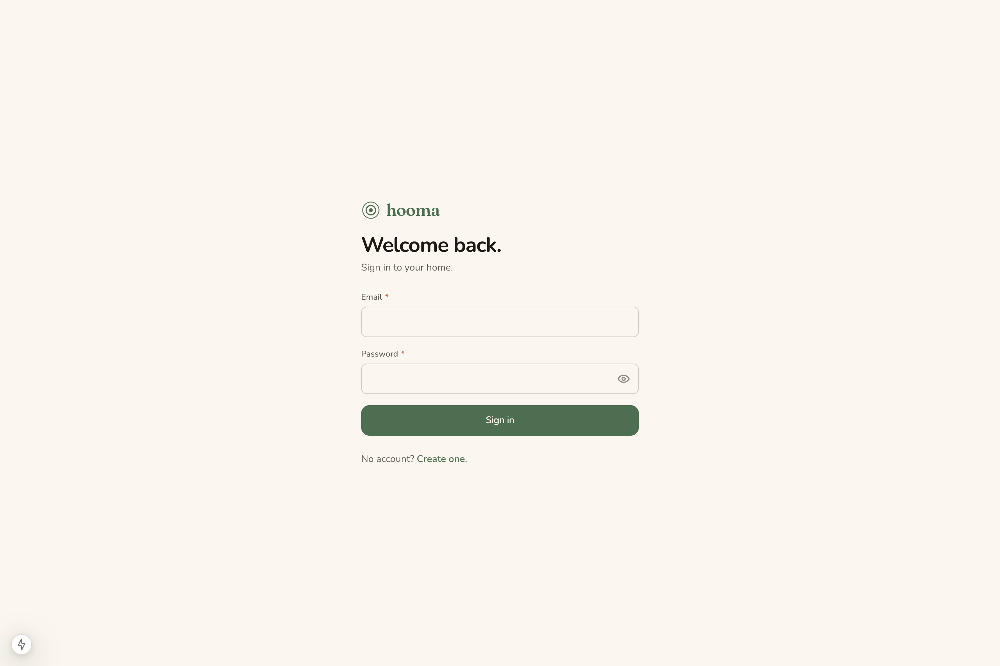

### Today — the Energy Core and the house's mood

The orb is read by a calm one-line summary beneath it, so the ambient signal is also legible. The participation banner appears because one invited housemate hasn't activated yet.

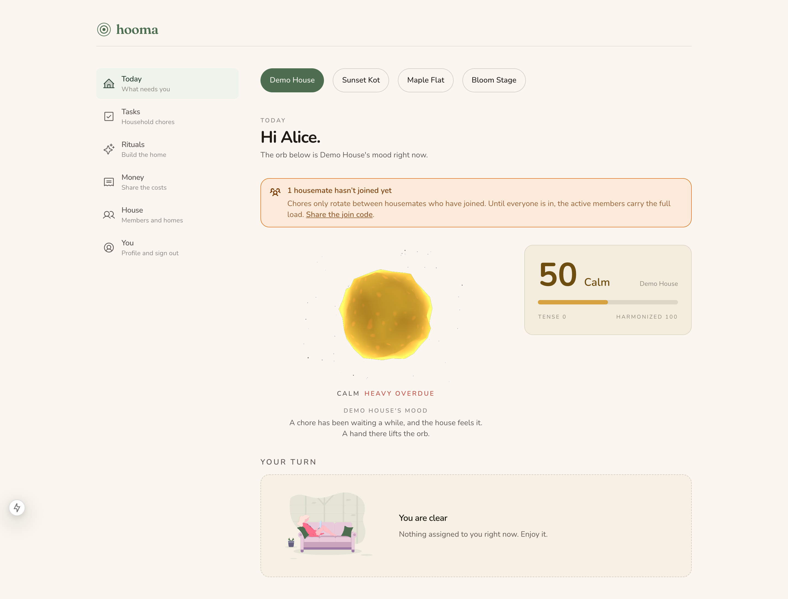

### A house in trouble — "Bloom Stage" demo (Harmony 16, Tense)

A heavy overdue chore scars the Core. Completing the overdue work heals the orb; completing a ritual that the household joins triggers a full Bloom.

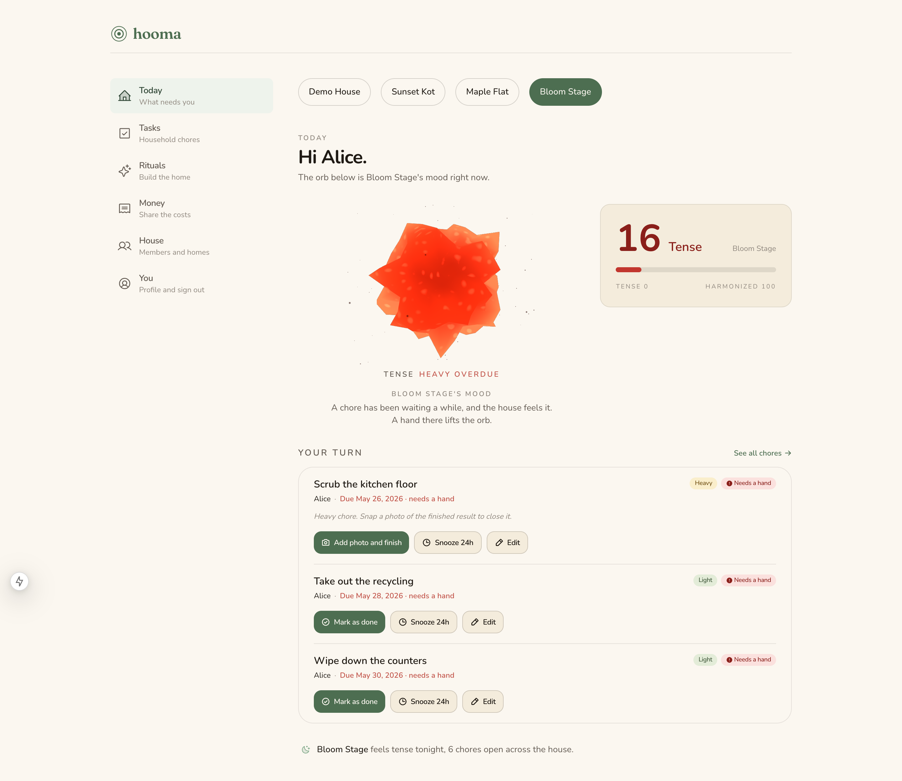

### Tasks — Smart Rotation, flag-a-mess, and caretaker chores

Every assignment carries a plain-language reason ("Admin has the lowest 30-day contribution score"). Flagging a mess is one tap plus one photo; caretaker-owned common-area chores sit outside the tenant rotation.

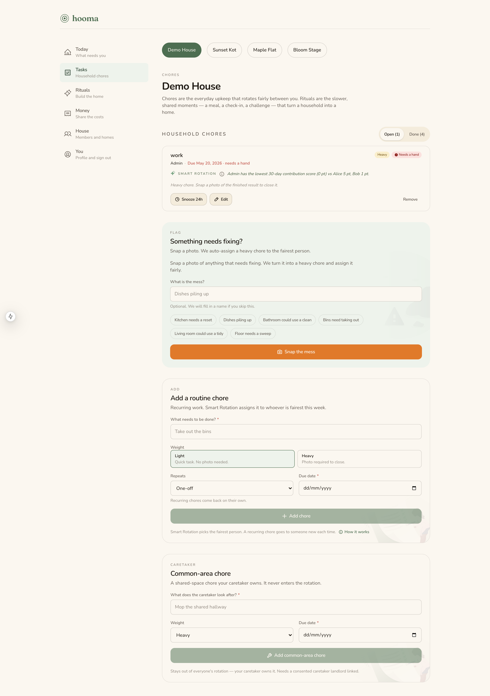

### Money — shared costs with two-sided settlement

Snap a receipt, correct the OCR draft, split the bill. Each debtor marks "I paid", then the creditor confirms "received" — no one-click fakes. A per-person net balance shows where everyone stands.

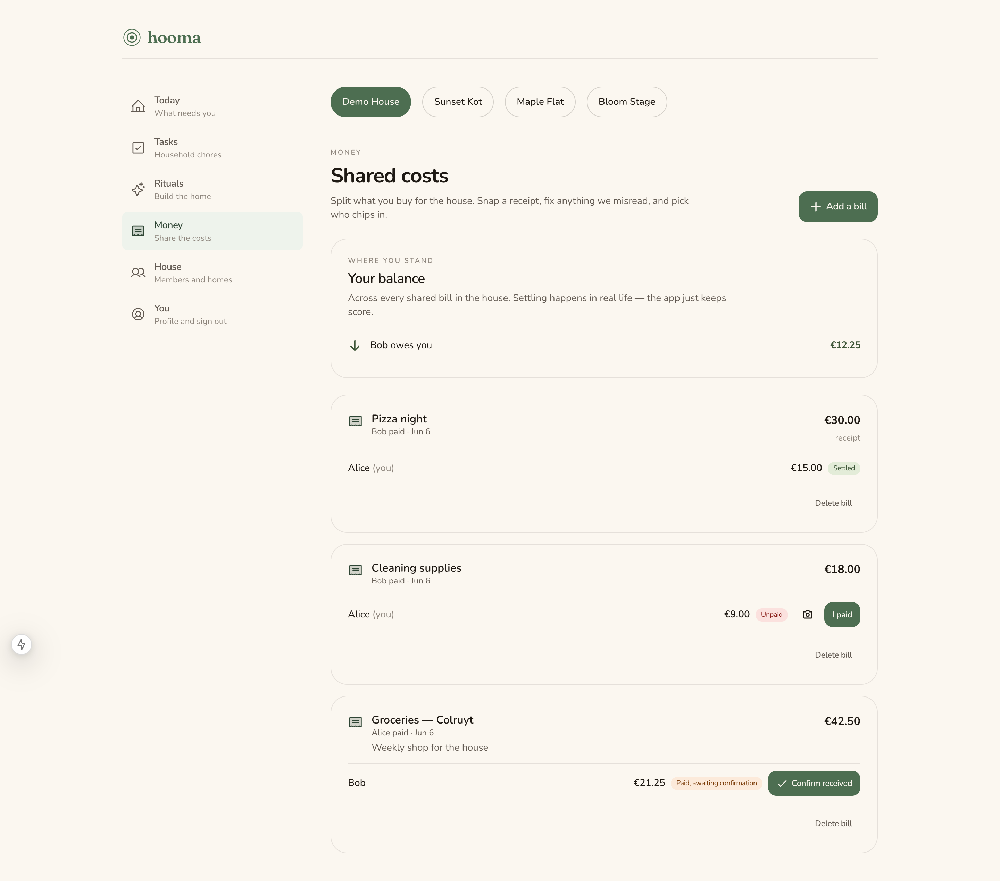

### House — members, supplies, and the landlord consent toggle

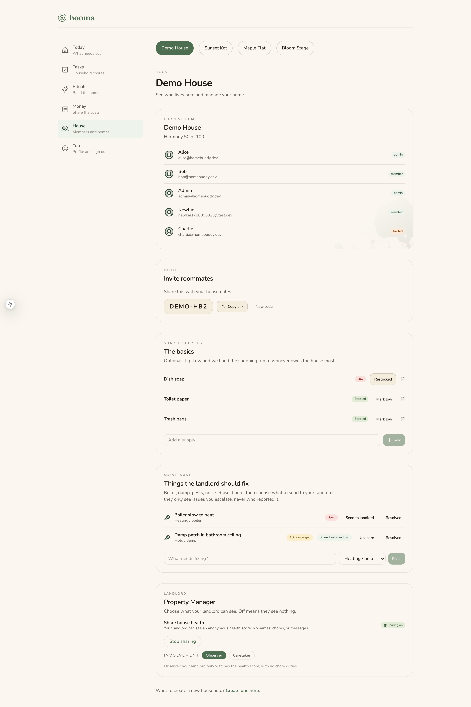

### Rituals — the slower work that builds solidarity

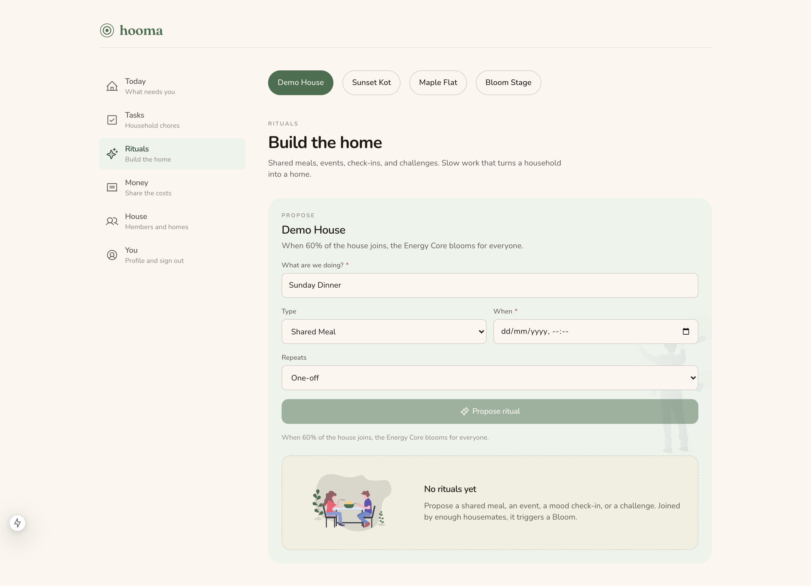

### Landlord portal — aggregate-only, by construction

The landlord sees a calm operator view: health score, churn risk, and counts — **no names, no chores, no messages**. Individual resident data cannot reach a landlord by design.

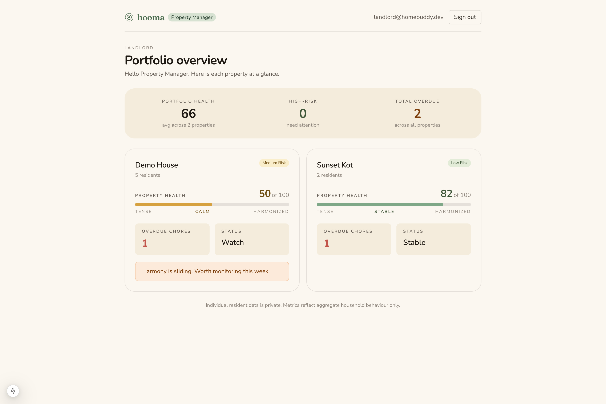

### Mobile-first

The same Today view on a phone. Touch targets ≥ 44px; primary actions sit at the bottom of the thumb.

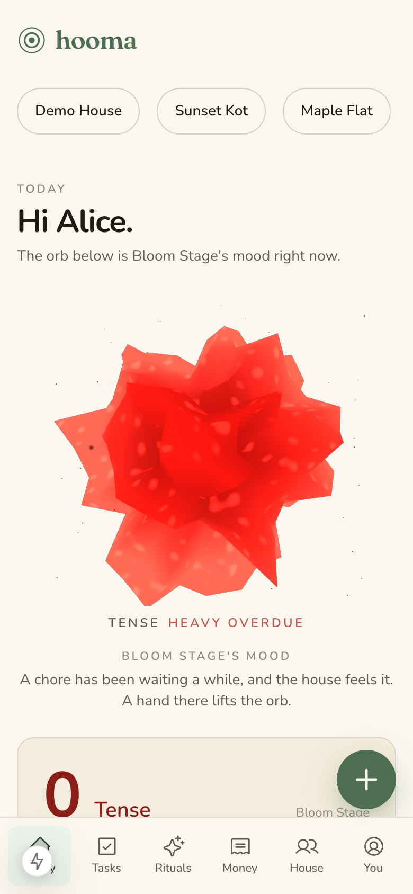

---

## 5. Feature tour

| Feature | What it does | Thesis hook |
|---|---|---|
| **Energy Core + Harmony Score** | A single 3D object + a 0–100 score express the whole household's state ambiently. | Emotional Design (Norman), Calm Technology (Weiser & Brown). |
| **Smart Rotation** | Assigns chores to the fairest person using a 30-day contribution score that also counts *in-flight* (open) load, so work never piles on one person. Every assignment shows its reason. | Equity Theory (Adams) — transparency is the fairness mechanism. |
| **Flag a mess** | Anyone can photograph shared-space mess; it becomes a reactive task auto-assigned fairly, framed as the space needing care, not a person being at fault. | Fogg Behaviour Model — a constructive prompt, not a complaint. |
| **Rituals** | Shared meals, check-ins, and challenges with a cadence. When enough of the house joins, the Core blooms. | Interaction Ritual Chains (Collins) — shared rituals build solidarity. |
| **Cost sharing (Money)** | Self-hosted receipt OCR (Tesseract, image never leaves the server) → editable draft → equal split → two-sided settlement → per-person netting. Tenant-only; never crosses into the landlord view. | Reduces a real, named source of friction without surveillance. |
| **Shared supplies** | Opt-in tracker; marking a supply low opens a fairly-assigned "Buy …" task. | Built opt-in because the survey showed supplies are often *not* pooled. |
| **Landlord relationship** | Optional, off by default, tenant-consented. Modes: **None / Observer / Caretaker**. | Directly answers the survey's split, contested view of landlords. |
| **Maintenance requests** | Tenants raise structural issues (boiler, mould, pests, noise); landlords in caretaker mode receive them without reporter identity. | The survey's real landlord value is *maintenance, not monitoring*. |
| **Offline-first PWA** | Service worker + IndexedDB queue: task completions and mess flags survive going offline and replay on reconnect. | Mobile reality of a distracted, one-handed user. |

---

## 6. Behavioural design rationale

HOOMA's distinguishing claim is that **every visible feature maps to a named behavioural theory and to the code that implements it.** This is the document defended in front of the jury: [`docs/design/behavioral-rationale.md`](docs/design/behavioral-rationale.md).

| Theory | How HOOMA expresses it |
|---|---|
| **Emotional Design** (Norman) | Visceral: the breathing Energy Core on a warm cream canvas. Behavioural: the two-second daily answer. Reflective: "I live in a fair house." |
| **Calm Technology** (Weiser & Brown) | Status lives in the periphery (orb colour/pulse), not in red-dot badges. There are **no unread-count badges** anywhere. Harmony *decays*, never crashes. This removes the thing users mute. |
| **Fogg Behaviour Model** (B = MAP) | Motivation: completing a chore visibly brightens the shared orb. Ability: flagging is one tap + one photo. Prompt: the flag is a hot prompt routed to the right person. |
| **Equity Theory** (Adams) | A black-box allocator reads as unfair even when it is fair — so every assignment carries a plain-language reason, and the fairness score counts in-flight load. No public "who slacks" ranking. |
| **Interaction Ritual Chains** (Collins) | Rituals are first-class; crossing a participation threshold blooms the house — a collective high, not an individual reward. The orb is the shared focus object the theory requires. |

---

## 7. System architecture

API-first monorepo. The NestJS API is the single source of truth for the domain; the Next.js web app is a client. The codebase is deliberately **mobile-ready**: tokens are returned in JSON (no session cookies), and all validation lives in a shared package so a future React Native client reuses the same schemas.

| Layer | Choice |
|---|---|
| Monorepo | pnpm workspaces + Turborepo |
| Backend | NestJS 11 (`apps/api`) — 15 feature modules |
| Frontend | Next.js 15 App Router + Tailwind 4 (`apps/web`) |
| Shared | `packages/shared` — Zod schemas, DTOs, types reused by API and web |
| Database | PostgreSQL 16 + Prisma 6 (14 models, 22 migrations) |
| Auth | JWT access (15 min) + refresh (30 d, hashed & revocable) |
| 3D | react-three-fiber / three.js (the Energy Core) |
| OCR | Self-hosted Tesseract (`tesseract.js`) — receipts never leave the server |
| Storage | S3-compatible abstraction (local disk in dev, R2/MinIO in prod) |
| Runtime | Node 22 LTS, pnpm 10 |

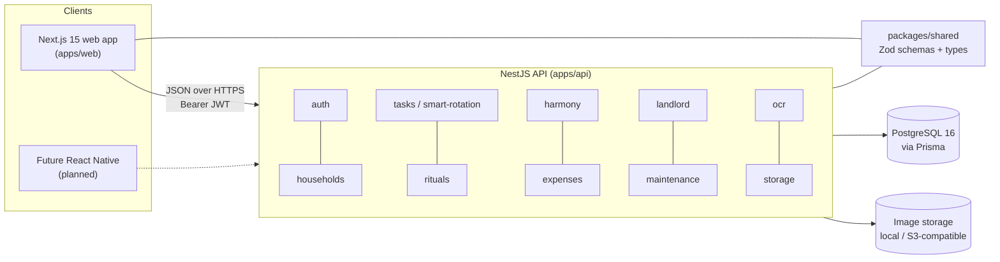

---

## 8. Database schema

PostgreSQL via Prisma. The schema is in [`apps/api/prisma/schema.prisma`](apps/api/prisma/schema.prisma). Core entities and their relationships:

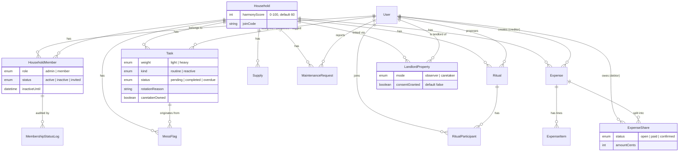

**Why the model looks like this:**

- **Roles are per-household, not global.** One person can be an admin of house A, a member of house B, and the landlord of property C simultaneously — so role lives on `HouseholdMember`, and the landlord relationship lives in its own `LandlordProperty` table. There is no global `User.role`.
- **Membership has a lifecycle.** `status` (active/inactive/invited) drives chore rotation, harmony penalties, and the participation warning; `MembershipStatusLog` keeps an audit trail.
- **Money is its own subgraph.** `Expense → ExpenseShare` models a single-payer, two-sided settlement; it touches neither the Harmony Score nor the landlord portal.

---

## 9. Authorisation & privacy model

The authorisation model is the spine of the app — full reference in [`docs/ROLES.md`](docs/ROLES.md), formal spec under [`docs/superpowers/specs/`](docs/superpowers/specs/).

**Four kinds of actor:**

| Actor | Where it lives | What it can see/do |
|---|---|---|
| **System support** | `User.systemRole = 'support'` | App-level admin (the developer). Bypasses membership checks; support tooling only. |
| **Household admin** | `HouseholdMember{ role: admin, status: active }` | Manages one household: invites/removes members, settings, assignment overrides. |
| **Household member** | `HouseholdMember{ role: member, status: active }` | Does chores, joins rituals, manages their own tasks. |
| **Landlord** | `LandlordProperty{ mode, consentGranted }` | **Optional, off by default.** Sees aggregate-only metrics, and **only while consent is granted**. Never sees names, tasks, photos, or per-person fault. |

**The Privacy Line** ([`docs/PRIVACY.md`](docs/PRIVACY.md)) is enforced in code, not by convention: landlord endpoints are gated on `consentGranted` and return aggregate-only data by construction, so no individual tenant identity can reach a landlord. Cost-sharing data is tenant-only and never crosses into the landlord portal. This is the technical answer to the survey's surveillance concern.

---

## 10. Running it locally

**Requirements:** Node 22, pnpm 10, Docker (for Postgres).

```bash
# 1. Install dependencies
pnpm install

# 2. Copy environment file
cp .env.example .env

# 3. Start Postgres (Docker)
pnpm db:up

# 4. Apply migrations + seed demo data
pnpm db:migrate
pnpm db:seed

# 5. Run API + web together
pnpm dev
```

- Web → http://localhost:3000
- API → http://localhost:4000 (routes are under `/api`)
- Postgres → host port `5433` (mapped from the container's 5432 to avoid clashing with a local install)

### Seeded demo accounts

All passwords are `password123`.

| Email | Role in the demo |
|---|---|
| `alice@homebuddy.dev` | Household admin (Demo House + test houses) |
| `bob@homebuddy.dev` | Household member |
| `charlie@homebuddy.dev` | Invited to Demo House, not yet activated (drives the participation warning) |
| `landlord@homebuddy.dev` | Landlord of the consented test properties (see the portal) |
| `admin@homebuddy.dev` | System support |

### Suggested demo path for the jury

1. Log in as `alice@homebuddy.dev` → **Bloom Stage** (Harmony 16, Tense): complete the overdue chores to heal the orb, then complete the pre-loaded ritual to trigger a full **Bloom**.
2. **Demo House** → open the **Money** page: confirm Bob's pending payment to watch a bill settle end-to-end.
3. Log in as `landlord@homebuddy.dev` to see the aggregate-only **portfolio overview** (two consented houses).

---

## 11. Testing & quality

- **29 spec files** across the API and shared packages — business logic (Smart Rotation fairness, settlement, harmony) is unit-tested; framework wiring is not.
- API and shared packages test with **Jest**; the web app uses **Vitest**.
- TypeScript strict everywhere — no `any`, no `@ts-ignore`.
- Conventions are enforced and documented in [`CODING_GUIDELINES.md`](CODING_GUIDELINES.md) and [`CLAUDE.md`](CLAUDE.md).

```bash
pnpm typecheck   # TS across the monorepo
pnpm lint        # lint all packages
pnpm test        # run the test suites
```

---

## 12. Deployment

The app stays continuously deployed at the live URL above. The full Railway playbook (Postgres + API + Web as three services from this repo) is in [`DEPLOY.md`](DEPLOY.md). In production, receipt images are stored via the S3-compatible driver (Cloudflare R2 / MinIO) rather than local disk.

---

## 13. Repository map

```
HomeBuddy/
├── apps/
│   ├── api/                  NestJS — domain source of truth
│   │   ├── prisma/           schema.prisma, seed.ts, migrations/
│   │   └── src/              auth, households, tasks, rituals, harmony,
│   │                         expenses, ocr, storage, landlord, maintenance,
│   │                         supplies, users, common, prisma
│   └── web/                  Next.js App Router (web client)
│       └── src/app/          (auth) · (app) household pages · (landlord) portal
├── packages/
│   ├── shared/               Zod schemas + types shared by api and web
│   └── tsconfig/             base tsconfig presets
├── docs/
│   ├── ROADMAP.md            road to the June 9 defence
│   ├── ROLES.md              authorisation model (operational reference)
│   ├── PRIVACY.md            the Privacy Line
│   ├── design/               behavioural-design rationale (for the jury)
│   ├── research/             survey analysis of record
│   ├── screenshots/          the images in this README
│   └── superpowers/specs/    formal design specs
├── docker-compose.yml        Postgres for local dev
└── DEPLOY.md                 Railway deployment playbook
```

Further reading:

- [`PRODUCT.md`](PRODUCT.md) — product purpose, users, tone, strategic principles
- [`DESIGN.md`](DESIGN.md) — design language (colour, type, motion, components)
- [`docs/design/behavioral-rationale.md`](docs/design/behavioral-rationale.md) — theory → feature → code
- [`docs/research/survey-findings.md`](docs/research/survey-findings.md) — research analysis of record

---

## 14. Author & credits

**HOOMA — Shared Living Harmony** is the bachelor thesis of **Ecaterina Moraru** (Katia), Multimedia and Creative Technologies, Karel de Grote Hogeschool (KDG), Antwerpen — 2026.

The thesis document (`EcaterinaMoraru_SharedLivingHarmony_BP2026`) accompanies this repository. The project is graded and defended as a bachelorproef; the codebase is written to be defensible — clean architecture, no shortcuts, research-grounded product decisions.

Open-source components gratefully used: NestJS, Next.js, Prisma, Tailwind CSS, three.js / react-three-fiber, Tesseract.js, Phosphor Icons (MIT), and unDraw illustrations (Katerina Limpitsouni).
